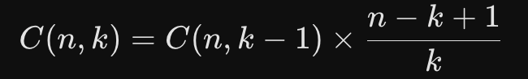

# Atividades da Aula 2

## Exercício 1: Impressão do Triângulo de Pascal em Formato Piramidal

O Desafio: O Triângulo de Pascal costuma ser resolvido armazenando a linha anterior em um vetor. Seu desafio é imprimir os $N$ primeiros níveis do triângulo em formato alinhado (pirâmide centralizada) sem usar nenhum vetor.

Enunciado: Escreva um programa que leia um número inteiro positivo $N$ (máximo 12 para não estourar os inteiros). O programa deve calcular cada termo $C(n, k)$ diretamente no laço usando a relação matemática de combinações:

Imprima o resultado formatado como uma pirâmide.

Exemplo de Entrada: 5

Exemplo de Saída:

'''txt
        1
      1   1
    1   2   1
  1   3   3   1
1   4   6   4   1
'''

## Exercício 2: Análise e Reversão Numérica com Validação de Palíndromo

O Desafio: Manipulação pura de dígitos numéricos usando aritmética de resto (% 10) e divisão (/ 10).

Enunciado: Leia um número inteiro positivo qualquer (usando long long). Sem converter para texto ou usar vetores, faça:

1. Inverta o número e diga se ele é um Palíndromo.

2. Identifique qual é o maior e o menor dígito contido no número.

3. Informe se os dígitos do número estão em ordem estritamente crescente, estritamente decrescente ou desordenados.

Exemplo de Entrada: 123454321

Exemplo de Saída:

'''txt
Número Invertido: 123454321
É Palíndromo: SIM
Maior Dígito: 5 | Menor Dígito: 1
Ordenação dos dígitos: Desordenados
'''

## Exercício 3: Simulador de Caixa Eletrônico com Estoque Limite de Cédulas

O Desafio: Um algoritmo guloso para troco é fácil, mas este exercício exige gerenciar estoque limitado de notas em caixa que persiste entre saques em um laço iterativo de menu.

Enunciado: Escreva um programa que simule um caixa eletrônico. O caixa inicia abastecido com:

- 5 notas de R$ 100
- 10 notas de R$ 50
- 10 notas de R$ 20
- 20 notas de R$ 10

O programa deve exibir um menu contendo as opções:

[1] Sacar
[2] Consultar Saldo do Caixa
[3] Sair

- No saque, o usuário digita o valor desejado.
- O sistema deve entregar o valor utilizando o menor número de cédulas possível, respeitando a quantidade de notas disponíveis no estoque.
- Caso o valor não possa ser sacado (seja por falta de saldo total ou por incapacidade de formar o valor exato com as notas disponíveis), o saque deve ser recusado e o estoque não pode ser alterado.

Exemplo de Cenário:

Se o caixa tem apenas notas de R$ 50 e o usuário pede R$ 80, o caixa deve informar que não é possível fornecer a quantia exata e rejeitar a operação.
